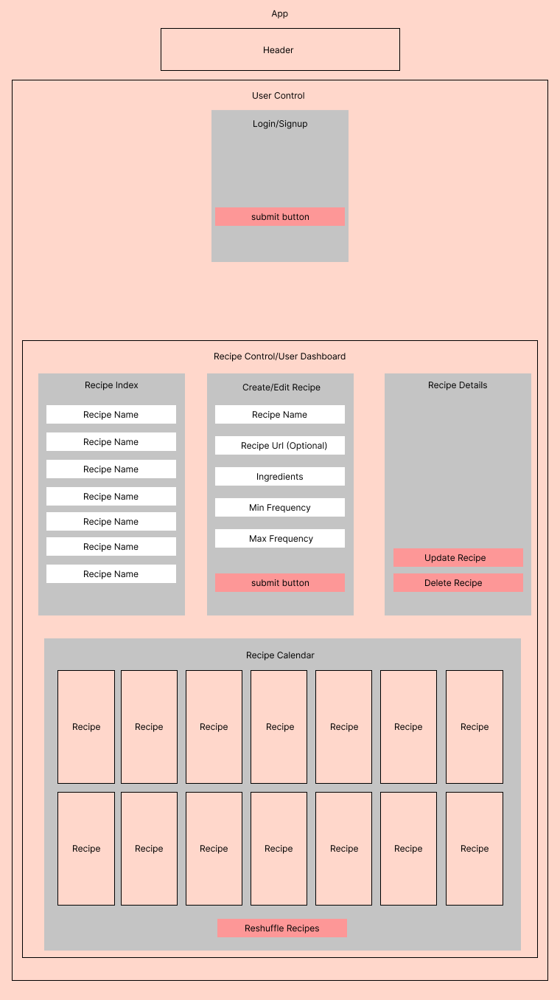

# 🍽️ Hey Kids, What's For Dinner? 🍝

_by Brenna Lavin_

## App Diagram



## Technologies Used

* C#
* ASP.NET Core
* Entity Framework Core
* MySQL
* JavaScript
* Spoonacular API

## Description

If you hate trying to figure out what you're going to eat, and you also hate using meal planning apps that try to give you new recipes to that you've never even thought of eating, then use this app! This app allows you to store your own recipes and create meal plans for breakfast, lunch, dinner or for all three. Enter in your recipe information, and how many times per week you'd ideally like to eat that meal and you're good to go!

## Setup/Installation Requirements

* To use this app you need MySQL and MySQL Workbench installed. Follow setup instructions [here](https://www.learnhowtoprogram.com/c-and-net/getting-started-with-c/installing-and-configuring-mysql).
* Clone this repository to your local machine
* In the root folder, create an ```appsettings.json``` file with the following code:

  ``` json

  {
  "ConnectionStrings": {
      "DefaultConnection": "Server=localhost;Port=3306;database=whatsfordinner;uid=root;pwd={YOURPASSWORDHERE};"
    }
  }
  ```

* Replace {YOURPASSWORDHERE} with the password you used when setting up MySQL
* Save this file then navigate to the main project folder by typing ```cd WhatsForDinner``` in your terminal
* type dotnet restore into the terminal to install the project's necessary dependencies.
* type ```dotnet ef database update``` into the terminal to ensure the database is properly connected.
* to run the app, type ```dotnet run``` into the terminal.
* Enjoy!

### Known Bugs

* none

### Research and Planning Log

``` text
Friday April 29th
8:15  - started Codecademy Flask course
8:40 - 10: 05 am - brainstorming session w/cohort
10:15 - start Adobe XD prototyping
10:30 - restarted prototype in Figma
11:00 - early lunch
12:00 - back from lunch
1:25 - finished Figma template, researching how to export figma template into react components
1:30 - 2:20 - another brainstorm session w/ cohort
2:30 - research Figma plugins for exporting components
3:00 - start writing out component code
6:00 - finish writing out basic recipe components

Monday May 2nd
- Change tech stack to C#/MVC with MySQL backend.

Friday May 6th
8:20 am - planned out models/views for project.

Wednesday May 18
8 am - research art for logo/front page
```

### License

MIT License

Copyright (c) [2022] Brenna Lavin

Permission is hereby granted, free of charge, to any person obtaining a copy of this software and associated documentation files (the "Software"), to deal in the Software without restriction, including without limitation the rights to use, copy, modify, merge, publish, distribute, sublicense, and/or sell copies of the Software, and to permit persons to whom the Software is furnished to do so, subject to the following conditions:

The above copyright notice and this permission notice shall be included in all copies or substantial portions of the Software.

THE SOFTWARE IS PROVIDED "AS IS", WITHOUT WARRANTY OF ANY KIND, EXPRESS OR IMPLIED, INCLUDING BUT NOT LIMITED TO THE WARRANTIES OF MERCHANTABILITY, FITNESS FOR A PARTICULAR PURPOSE AND NONINFRINGEMENT. IN NO EVENT SHALL THE AUTHORS OR COPYRIGHT HOLDERS BE LIABLE FOR ANY CLAIM, DAMAGES OR OTHER LIABILITY, WHETHER IN AN ACTION OF CONTRACT, TORT OR OTHERWISE, ARISING FROM, OUT OF OR IN CONNECTION WITH THE SOFTWARE OR THE USE OR OTHER DEALINGS IN THE SOFTWARE.
